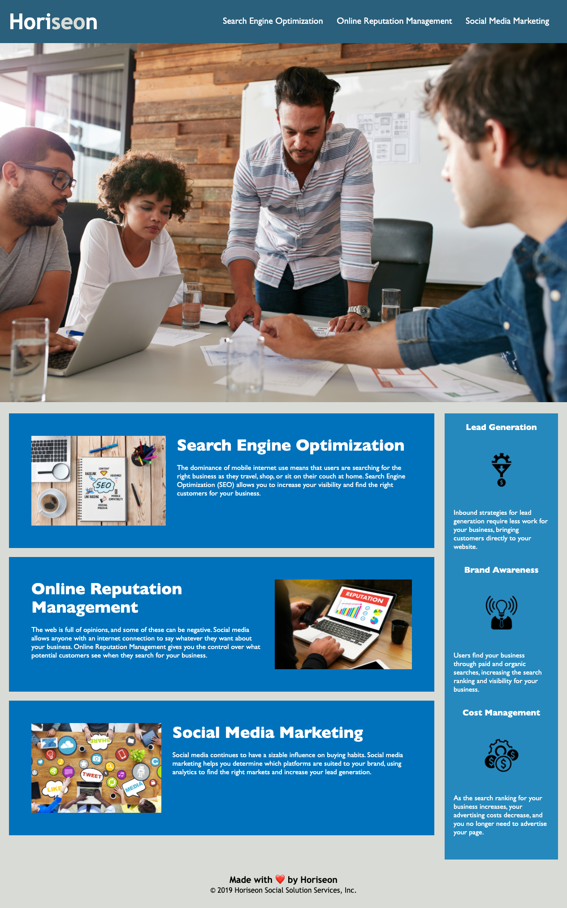
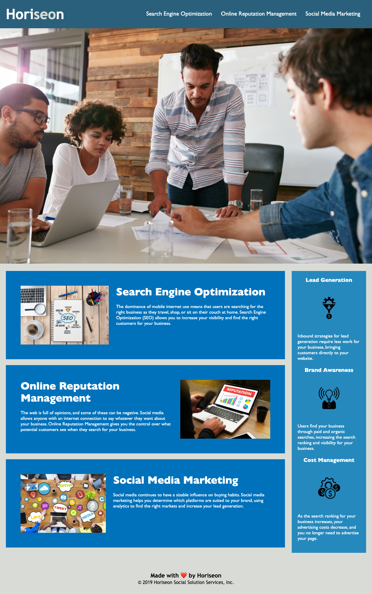

# Horiseon Project

## Project Link

You can view the project on GitHub pages by clicking [here](https://dominikacookies.github.io/homework_07032021//).
## Description

The main goal of this project was to make the Horiseon website more accessible by refractoring its code inline with the accessibility criteria shared by the client. 

### How was this achieved?

- Improved the accessibility of images by adding alt attributes to the images
- Replaced HTML elements with semantic HTML elements
- Fixed nav link bug so that it scrolled to the appropriate section of the page
- Corrected the indentations within the html file to improve readability for future developes
- Consolidated html classes where appropriate to ensure that the next developer can read the code easily
- Added comments to the html and css files for the above reason
- Updated the title of the webpage for SEO purposes
- Adapted the structure of the css and html files so that they flowed in a logical order

### Getting Started

- Clone the GitHub project on to your local machine
- Navigate in to the project
- Open the project in VSCode
- Open the `index.html` file in your default browser

```
git git@github.com:dominikacookies/homework_07032021.git
cd homework-week-1
code .
```

## Screenshots

### Before Refactor



### After Refactor

